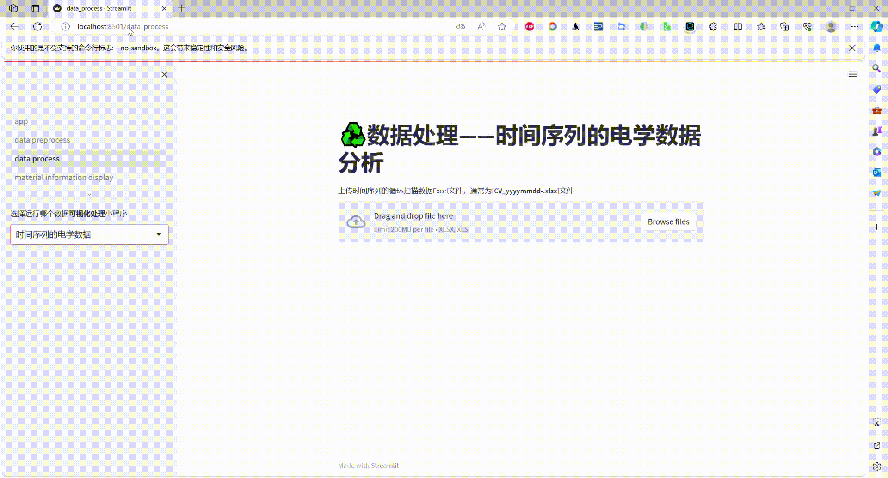

最近借助streamlit框架搭建了一直想做的材料科学研究中的**可视化**数据整理与展示平台demo，此web框架可以在本地运行，并且将展示版本部署到了个人云服务器上。
以下是一部分展示：
<table>
  <tr>
    <td></td>
    <td></td>
  </tr>
  <tr>
    <td></td>
    <td></td>
  </tr>
</table>
